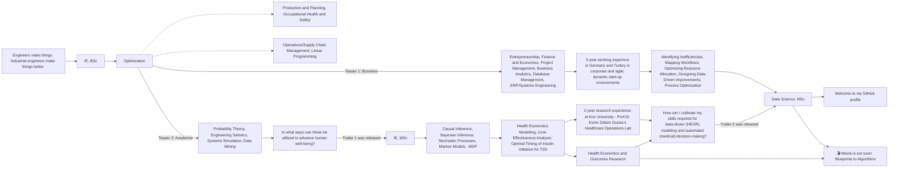

#### 🌐 Feel free to contact me
###  &nbsp;Faik Erkam Minsin

---

#### 💻 Technical Skills

 

<!--  -->
<!--  -->

---

<h3 align="left">🚀 About Me</h3>

   
 

🦾 Raised in working-class 
🤺 Fought for my own path 
🆔 Traveled Europe and studied different teaching approaches 
🏄‍♂️ Live with and learn from different people and cultures 
📍 Chasing my dreams in <strong>Berlin, Germany</strong> 
🛵 Invested in theory first 
🏎 Producing it all now  

<strong>📌 My Education</strong>  
🔆 Bielefeld University&nbsp;&nbsp;&nbsp;&nbsp;&nbsp;&nbsp;&nbsp;&nbsp;&nbsp;&nbsp;&nbsp;&nbsp;🎓 Data Science, MSc | German School of Thought | 
🔆 Galatasaray University&nbsp;&nbsp;&nbsp;&nbsp;&nbsp;&nbsp;&nbsp;🎓 Industrial Engineering, MSc | French | 
🔆 Linnaeus University &nbsp;&nbsp;&nbsp;&nbsp;&nbsp;&nbsp;&nbsp;&nbsp;&nbsp;&nbsp;&nbsp;🎓 Industrial Engineering, BSc | Scandinavian | 
🔆 Fatih University &nbsp;&nbsp;&nbsp;&nbsp;&nbsp;&nbsp;&nbsp;&nbsp;&nbsp;&nbsp;&nbsp;&nbsp;&nbsp;&nbsp;&nbsp;&nbsp;&nbsp;🎓 Industrial Engineering, BSc | Turkish & American |  

<strong>📌 My Career Journey</strong> 

<strong>📌 Learning Library</strong>  

&nbsp;&nbsp;&nbsp;&nbsp;

&nbsp;&nbsp;&nbsp;&nbsp;

&nbsp;&nbsp;&nbsp;&nbsp;

&nbsp;&nbsp;&nbsp;&nbsp;

&nbsp;&nbsp;&nbsp;&nbsp;

&nbsp;&nbsp;&nbsp;&nbsp;

&nbsp;&nbsp;&nbsp;&nbsp;

&nbsp;&nbsp;&nbsp;&nbsp;

&nbsp;&nbsp;&nbsp;&nbsp;

&nbsp;&nbsp;&nbsp;&nbsp;

&nbsp;&nbsp;&nbsp;&nbsp;

&nbsp;&nbsp;&nbsp;&nbsp;

&nbsp;&nbsp;&nbsp;&nbsp;

&nbsp;&nbsp;&nbsp;&nbsp;

&nbsp;&nbsp;&nbsp;&nbsp;

&nbsp;&nbsp;&nbsp;&nbsp;

&nbsp;&nbsp;&nbsp;&nbsp;

&nbsp;&nbsp;&nbsp;&nbsp;

&nbsp;&nbsp;&nbsp;&nbsp;

  

<strong>📌 Production Shelf</strong>  
🧭 Advanced Statistics, ML, DL, NLP, AI, Real-World Evaluation 
🧭 Bayesian Inference, Stochastic Processes, Markov Decision Process, HEOR  

| Math Skills | Project | Tech Skills |
|:-----|:---------------|:-------|
| Descriptive Statistics Basic Probability Linear Algebra |    |      |
| Distribution Types Central Limit Theorem Bootstraping Confidence Intervals Significance Tests Goodness of Fit Linear Regression Analysis of Variance |    |  |
|   Numerical Computation Descriptive Statistics Statistical Visualization and Interpretation Parametric Statistical Testing Non-parametric Statistical Testing Regression and Linear Modeling  |       |  |
| Multiple Linear Regression OLS Estimation Hypothesis Testing: F-test Model Selection: R-squared, Leave-one-out Cross Validation, AIC, BIC Model Diagnosis: Linearity, Homoscedasticity, VIF, Influence Analysis - Outliers, Leverage, Cook's Distance Heteroscedastic Errors - Breusch-Pagan Test, Two-Stage Least Squares, White-Estimators Price Prediction |    |        |
|     3|                |        |
|     3|                |        |
|     3|                |        |
|     3|                |        |
|     3|                |        |
|     3|                |        |

 

<!-- I love to play with numbers with a focus on their real-world impact - analyzing patterns, modeling outcomes, and generating insights that support better decisions in health and business. -->

🔭 I’m currently working on CONSTRUCTING MY GITHUB PROFILE NEW 👯 I’m looking to collaborate on 🤝 I’m looking for help with 🌱 I’m currently learning 💬 Ask me about ⚡ Fun fact

---

> “Let the beauty we love be what we do.”
