```mermaid
graph LR
    A["Engineers make things. Industrial engineers make things better."] --> B["IE, BSc"];
    B --> C["Linear Programming, Deductive Inference, Optimization"];
    C --> D["How can i use it for humanity?  -Healthcare"];
    D --> E["IE, MSc"];
    E --> F["Bayesian Inference, Stochastic Processes, MDP, HEOR"];
    F --> G["How can I learn data-driven modeling and decision-making?"];
    G --> H["Data Science, MSc"];
    H --> I["Hello! Welcome to GitHub Profile"];
```

### 🌐 Feel free to contact me:
### Faik Erkam Minsin, MSc  &nbsp;&nbsp;&nbsp;  

---

### 💻 My Tech Skills

 

---

<h3 align="left">🚀 A Little About Me</h3>

   
 

🦾 Raised in working-class 
🤺 Fought for my own path 
🆔 Traveled Europe and experienced different teaching approaches 
🏄‍♂️ Lived with and learnt from different people and cultures 
📍 Chasing my dreams in <strong>Berlin, Germany</strong> 
👯 Can adapt quickly 
🤥 Learnt all the theory 
🚵 Practing it all now 

<strong>📌 My Education Journey:</strong>  
🔆 Bielefeld University&nbsp;&nbsp;&nbsp;&nbsp;&nbsp;&nbsp;&nbsp;&nbsp;&nbsp;&nbsp;&nbsp;&nbsp;🎓 <strong>Data Science, MSc</strong> | German School of Thought | 
🔆 Galatasaray University&nbsp;&nbsp;&nbsp;&nbsp;&nbsp;&nbsp;&nbsp;🎓 <strong>Industrial Engineering, MSc</strong> | French | 
🔆 Linnaeus University&nbsp;&nbsp;&nbsp;&nbsp;&nbsp;&nbsp;&nbsp;&nbsp;&nbsp;&nbsp;&nbsp;🎓 <strong>Industrial Engineering, BSc</strong> | Scandinavian | 
🔆 Istanbul University&nbsp;&nbsp;&nbsp;&nbsp;&nbsp;&nbsp;&nbsp;&nbsp;&nbsp;&nbsp;&nbsp;&nbsp;🎓 <strong>Industrial Engineering, BSc</strong> | Turkish & American |  

<strong>📌 Research Interests:</strong> 
🧭 Advanced Statistics, ML, DL, NLP, AI, Real-World Evaluation 
🧭 Bayesian Inference, Stochastic Processes, Markov Decision Process, HEOR 

<strong>My languages (test)</strong>
 

| . | Language |
|-----:|-----------:|
|     1| Python|
|     2| R    |
|     3| SQL       |

 

<strong>💼 Open to Research Opportunities</strong> 

| Rank | THING-TO-RANK |
|-----:|:---------------:|
|     1|     `git status` : test         |
|     2|               |
|     3|               |
  

<!-- I love to play with numbers with a focus on their real-world impact - analyzing patterns, modeling outcomes, and generating insights that support better decisions in health and business. -->

🔭 I’m currently working on 👯 I’m looking to collaborate on 🤝 I’m looking for help with 🌱 I’m currently learning 💬 Ask me about ⚡ Fun fact

  

---
> “Let the beauty we love be what we do.”
